# Quicksilver IT Site

README.md file for my Code Institutute first project.

I decided to do a simple design for a company that I used to own.
Quicksilver IT Ltd provided IT support for small businesses in Hertfordshire.

The site is designed to show potential customers what services the company offers, and encourage them to contact the company.

It is hosted on Github here [Quicksilver IT](https://mark279455.github.io/Quicksilver-IT/index.html)

[Mark Cooper QuicksilverIT Github Repository](https://github.com/mark279455/Quicksilver-IT)

## Technology Used

HTML
CSS
Google Fonts
Font Awesome icons (these require javascript)

## Design

The site consists of 3 responsive pages.
index.html
service.html
contactus.html

### Colours

The Company's logo was a green Q - this is the text colour for the site.
A complementary colour has been added with a keyboard as a background.
These are:
#165B11 as text colour.
#a5f4dc as background

### Typography

The fonts used are from Google Fonts.
They are:
Montserrat - sans-serif
Ubuntu - sans-serif

The creator is ot a fan of serif fonts.

### Background Image

the background image is one the creator took of his daughter's laptop.

---
## Wireframes

Wireframes were created for the following screen widths:

320 - 420 px wide
421 = 672 px wide
672 and wider

### Index.html - less than 420px

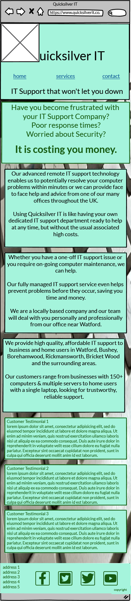

### Index.html - 421 to 672px

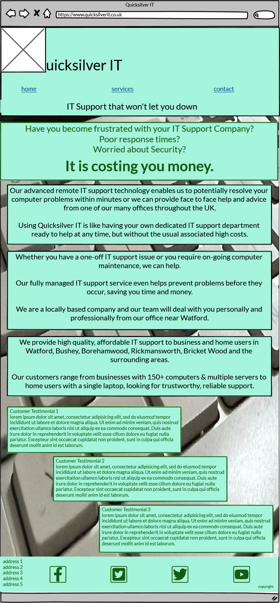

### Index.html - 673px and wider

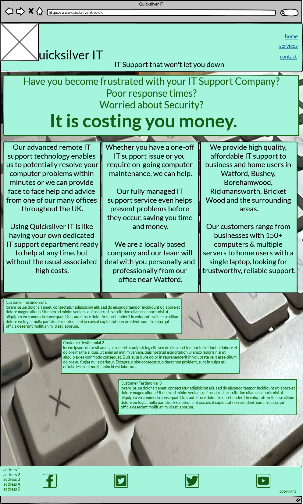

### services.html - less than 420px

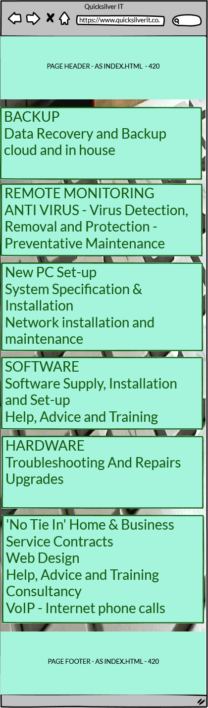

### services.html - 421 to 672px

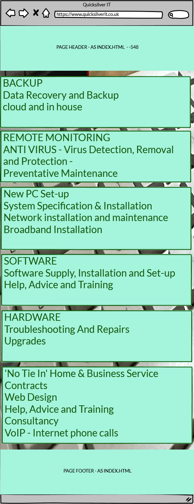

### services.html - 673px and wider

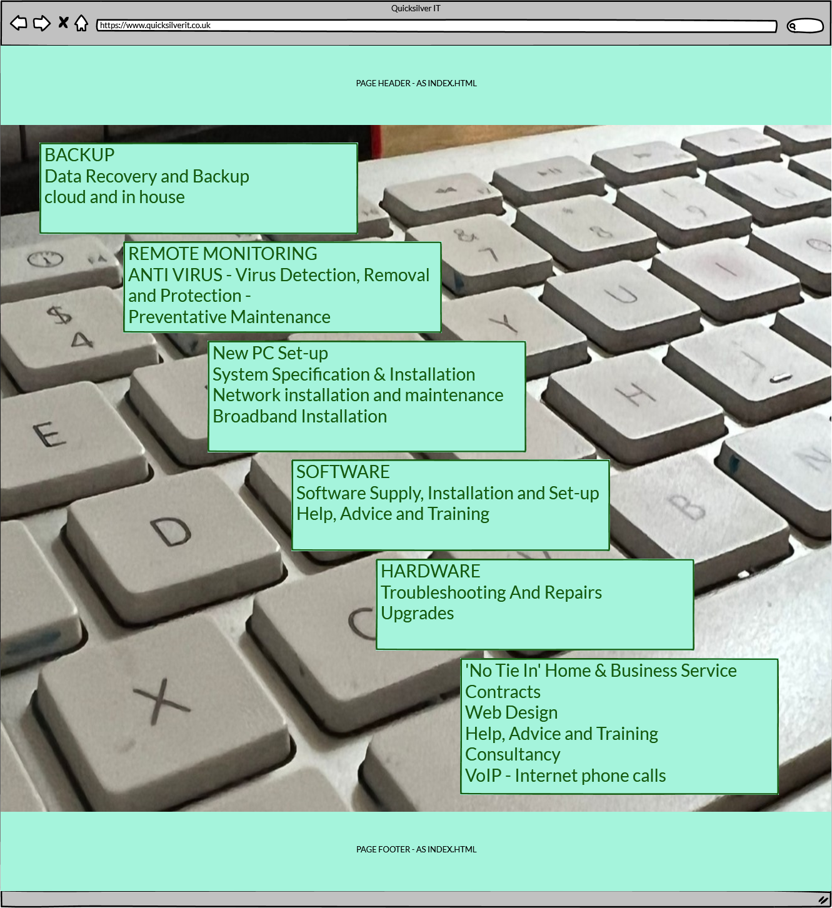

### contactus.html - less than 420px

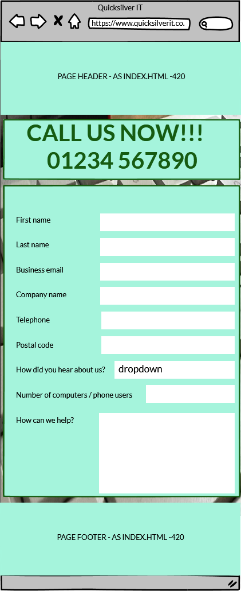

### contactus.html - 421 to 672px

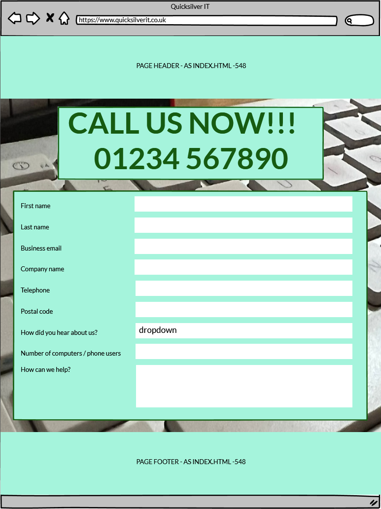

### contactus.html - 673px and wider

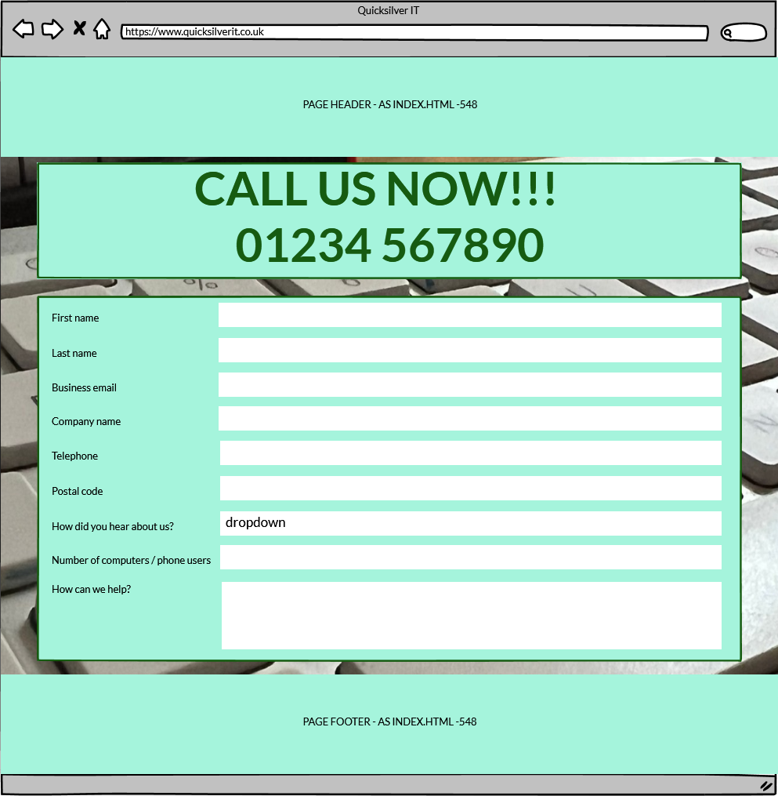

---
## Features

### Features on all pages

1.  Naviagion from the header to each page.
    * Home
    * Services
    * Readme

    The header stays at the top of all displays all the time.
    This changes from a horizontal list at less than 763px and a vertical list on the right over 762px.
    These also highlight to show which page is currently loaded.

2.  Social Media Icons in the footer that have tooltips to describe them on hover.
    The footer stays at the bottom of all displays all the time.

### Index.html

1.  Three sections that attend to 3 subjects.

    *   A sales section
        This contains a list of problems that the user may have with their current IT Support Company.
        It also has a blinking line telling the user that poor IT Support is costing money.

        As the screen width increases, the font size increases.

    *   A section that describes why Quicksilver IT is different.
        This describes some details about who Quicksilver IT are and how they operate.

        As the screen width increases, these containers change from a column arragement to a step across type display, and at larger screen sizes into 3 columns.

    *   A testimonials section that shows 3 testimonials from different clients.
        As the screen width increases, these containers change from a column arragement to a left-right block type display.

---
### services.html

1.  One Section with 6 containers.

    *   IT Support Solutions
    *   Cloud Services
    *   Cyber Security
    *   Telecoms & Mobile
    *   Data Protection
    *   Other Services

    Thse have Font Awesome icons with their titles, and a block of text describing the importance of each service offered.

    As the screen width increases, these containers change from a singel column to two columns and finally to three.

### contactus.html

1.  A header and a form.

    The header blinks to the user showing the number to telephone, or offers the form.

    The form takes values for the following - all fields are required.

    *   First Name
    *   Last Name
    *   Business Email
    *   Company name
    *   Telephone / Mobile
    *   Post Code
    *   Number of computers
    *   How can we help?
     
        This option has a textfield for the user to describe their issues.

    *   How did you hear about us - 

        This option gives a dropdown with the following options:
        +   Internet search
        +   Advertisement
        +   Social media
        +   Word of mouth
        +   Business networking

    As screen width increases the form increases width and font until 763px wide is reached, when it stays at a set width of 584px wide.

    
---
## Tests and Validation

the three html files were validated successfully by the W3.org html validator.

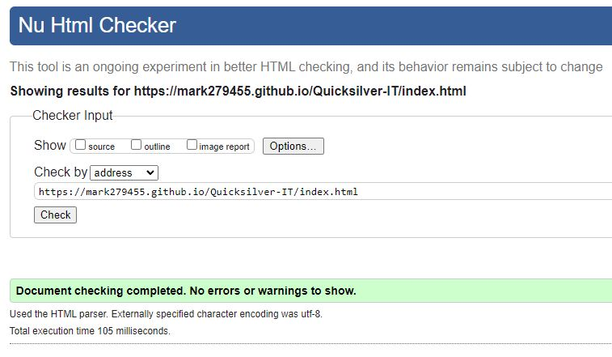

The site was verified by the W3.org CSS Validator page as well.

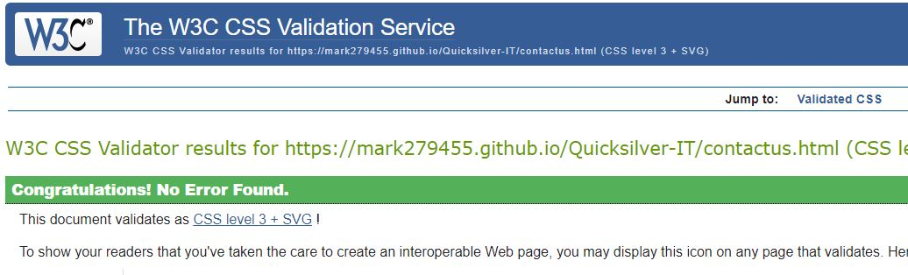

Lighthouse provided scores all over 90%, and also warned about the Logo being low resolution. This was a design choice.

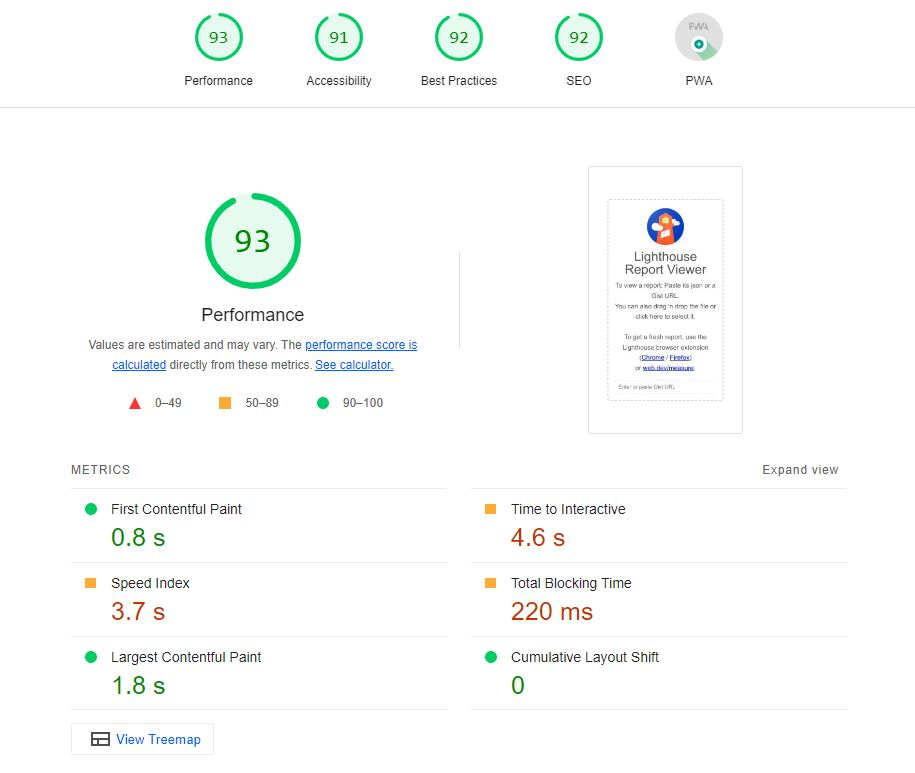

Wave produced a report showing 2 alerts.

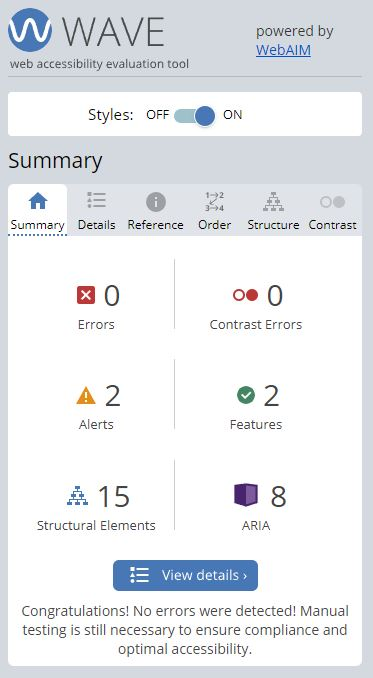
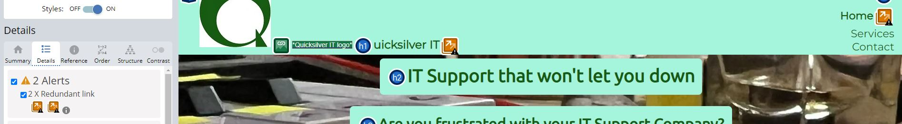

These alerts related to a duplicated link in the header - which was a design choice.

---
## Bugs

The form on the contactus page does not check that the input for number of computers is negative. For this to work, javascript would be required.

